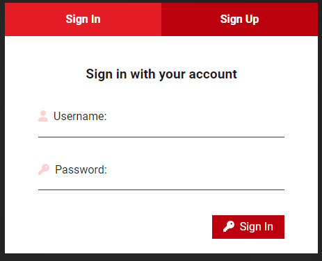
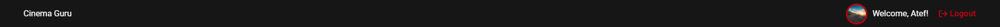
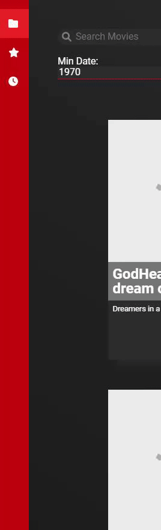
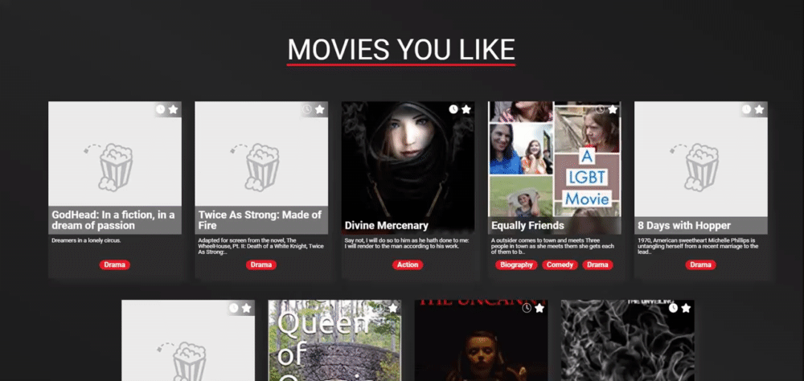
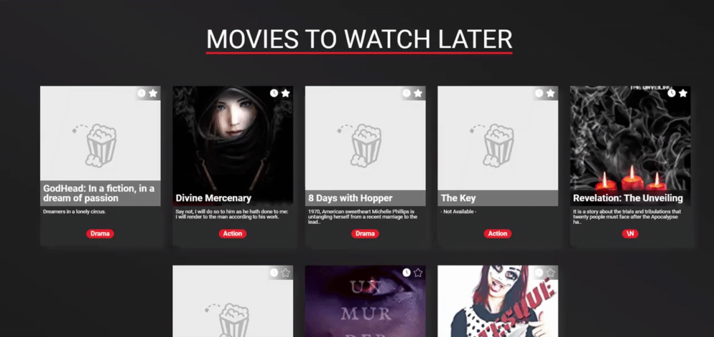
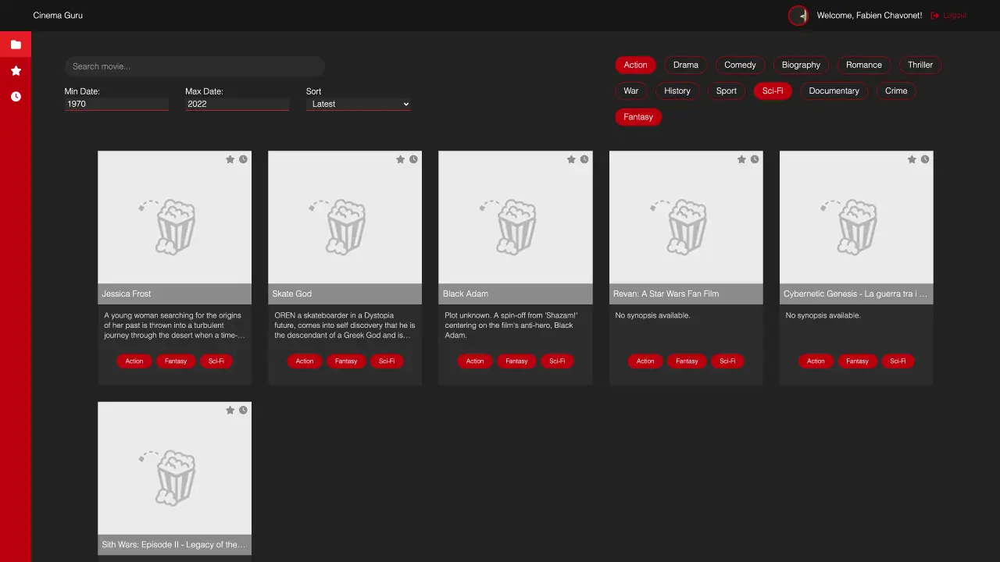

# Implement an app with React

## Description

Cinema Guru is a movie tracking web application built with ReactJS.

It allows users to register, log in, and manage their favorite and watch later movie lists, all synchronized with a backend API powered by Docker and PostgreSQL.

The project follows a Figma design system and demonstrates proficiency in state management, routing, authentication, and reusable UI components within a React-based environment.

## Objectives

At the end of this project, I should be able to explain to anyone, **without the help of Google**:

- How to manage state and props in a React component.
- How to use React Hooks to handle component behavior.
- How to implement a design using JSX and CSS.
- How to build a frontend application using React and integrate it with an external API.
- How to handle JWT authentication in a React app.
- How to structure a scalable and maintainable React project.

## Requirements

- All components must be functional components (no class components).
- The project must include a README.md file at the root of the repository.
- Must use ES6+ features wherever possible.
- The app must be served on port 3000 using Vite.
- The backend must be running locally via Docker Compose.
- Base API URL: http://localhost:8000/

## Instructions

### Mandatory

<details>
    <summary>
        <b>0. Cloning the Figma project</b>
    </summary>
    <br>

Create an account in [Figma](https://www.figma.com/) if you don’t have one and open [this project](https://www.figma.com/design/RPc247kHDXz5QeFNUM3Gs6/Holbertonschool---Cinema-Guru?node-id=0-1&p=f) and "Duplicate to your Drafts" to have access to all design details.

If you can’t access it, please find here the [Figma file](./public/files/figma_file.fig).


***All the components designs that we will be working on could be found in the Figma file.***

#
**Repo:**
- GitHub repository: `holbertonschool-cinema-guru`.
<hr>
</details>

<details>
    <summary>
        <b>1. Setting up the workspace</b>
    </summary>
    <br>

In this project, we will use the `yarn` package manager instead of `npm`.

- Using `yarn create` and the build tool `vite`, create your React app.
- Make sure your App component returns an empty `div` with `className="App"`.
- In your `vite.config.js` define the network port `3000`.
- In your `index.html` define your web page title to `Holberton - Cinema guru`.

**Packages**

This is the list of packages we will need throughout this project:

- `@fortawesome/fontawesome-svg-core 6.7.0`.
- `@fortawesome/free-solid-svg-icons 6.7.0`.
- `@fortawesome/react-fontawesome 0.2.2`.
- `axios 1.7.7`.
- `lodash 4.17.21`.
- `normalize.css 8.0.1`.

Install them and make sure they’re added as dependencies.

**Project Structure**

This will be the general folder structuring:

- public/
- src/
  - assets/
  - components/
  - routes/

**Make sure all your source files are under the repository root and not under a subdirectory.**

#
**Repo:**
- GitHub repository: `holbertonschool-cinema-guru`.
- File: `README.md`, `package.json`, `public/`, `src/assets/`, `src/components`, `src/routes`, `src/App.jsx`.
<hr>
</details>

<details>
    <summary>
        <b>2. Adding the general use components</b>
    </summary>
    <br>

In this task we will add various general components that we will be using almost in every major component.

**Input**


Create `src/components/general/Input.jsx`:

- The file should import `general.css`
- The file should export a functional component named `Input` as default:
  - Input must accept these props:
    - `label`: String – The input label.
    - `type`: String – Input type.
    - `className`: String – Input custom classes.
    - `value`: Any – The controlled state.
    - `setValue`: Function – The setState function of the above state.
    - `icon`(optional): FontAwesomeIcon – An icon to decorate the input with.
    - `inputAttributes`(optional): Object – Other input attributes.
- Input’s return value must contain a html input with the appropriate attributes from the props:
- Create `handleInput` function that takes the `onChange` event as parameter and sets the value to the event target value using the `setValue` prop and pass it to the input `onChange` event.

**SelectInput**


Create `src/components/general/SelectInput.jsx`:

- The file should import `general.css`.
- The file should export a functional component named `SelectInput` as default:
  - SelectInput must accept these props:
    - `label`: String – The input label.
    - `options`: Array – Array of select options.
    - `className`: String – SelectInput custom classes.
    - `value`: Any – The controlled state.
    - `setValue`: Function – The setState function of the above state.
- SelectInput’s return value must contain a html select tag with the appropriate attributes from the props:
  - Inside the select tag, map each option from the options prop to return an option tag with the appropriate attributes and text inside.
- Create `handleSelect` function that takes the `onChange` event as parameter and sets the value to the event target value using the `setValue` prop and pass it to the select `onChange` event.

**Button**


Create src/components/general/Button.jsx:

- The file should import `general.css`.
- The file should export a functional component named `Button` as default:
  - Button must accept these props:
    - `label`: String – The button label.
    - `className`: String – Button custom classes.
    - `onClick`: Function – The onClick handler for the button.
    - `icon`(optional): FontAwesomeIcon – An icon to decorate the button with.
- Button’s return value must contain a html button tag with the appropriate attributes from the props:
  - Inside the button tag, there should be a FontAwesomeIcon if provided and the button text.
- Bind the button `onClick` event with the `onClick`function passed from the props.

**SearchBar**


Create `src/components/general/SearchBar.jsx`:

- The file should import `general.css`.
- The file should export a functional component named `SearchBar` as default:
  - Button must accept these props:
    - `title`: String – The controlled state.
    - `setTitle`: String – The setState function of the above state.
- SearchBar’s return value must contain a html input with the appropriate attributes from the props:
- Create `handleInput` function that takes the `onChange` event as parameter and sets the value to the event target value using the `setTitle` prop and pass it to the input `onChange` event.

**general.css**

Create `src/components/general/general.css`:
- Add the necessary css rules to assure the components design provided in Figma.

#
**Repo:**
- GitHub repository: `holbertonschool-cinema-guru`.
<hr>
</details>

<details>
    <summary>
        <b>3. Initialize the main App component</b>
    </summary>
    <br>

Now we will add the main App component that will host all of the others.

**App**

Edit `src/App.jsx`:

- The file should import `App.css`.
- The file should export a functional component named `App` as default:
  - Add the following state to the component using the `useState` hook:
    - `isLoggedInBoolean`: default: `false`.
    - `userUsernamestring`: default: `""`.
  - Use the `useEffect` hook to do the following whenever the component mounts:
    - Get the value of `accessToken` item from the `localStorage`.
    - Send a post request to `/api/auth/` with the `authorization` header set to `Bearer <accessToken>`.
      - `onSuccess` set the isLoggedin and the userUsername state to true and the username from the response object respectively.
  - App must return depending on the isLoggedIn state :
    - `true`: The Dashboard component (Will be built in later tasks).
    - `false`: The Authentication component (Will be built in later tasks).

#
**Repo:**
- GitHub repository: `holbertonschool-cinema-guru`.
<hr>
</details>

<details>
    <summary>
        <b>4. Authentification - Component behavior</b>
    </summary>
    <br>

In this task we will add the three main authentication components `Authentication Login Register`.

**auth.css**

Create `src/routes/auth/auth.css`:

This file would host all the css needed for the authentication components.

**Authentication**


The `Authentication` component will be the parent of the two other mentioned component. It will allow us to switch between logging in or registering when clicking the header buttons.

Create `src/routes/auth/Authentication.jsx`:

- The file should import `auth.css`.
- The file should export a functional component named `Authentication` as default:
  - Authentication must accept these props:
    - `setIsLoggedIn`: function – The setState for the isLoggedin state.
    - `setUserUsername`: function –The setState for the userUsername state.
  - Add the following state to the component using the `useState` hook:
    - `_switch`: boolean default: `true`.
    - `username`: string default: `""`.
    - `password`: string default: `""`.
  - Authentication must return a html `form` in which there’s two `Buttons`:
    - Sign In: When clicked sets the `_switch` state to `true`.
    - Sign Up: When clicked sets the `_switch` state to `false`.

**Login**



The `Login` will host the components needed to login.

Create `src/routes/auth/Login.jsx`:

- The file should import `auth.css`.
- The file should export a functional component named `Login` as default:
  - Login must accept these props:
    - `username`: string – The username controlled state.
    - `password`: string – The password controlled state.
    - `setUsername`: function – The setState for the username state.
    - `setPassword`: function –The setState for the password state.
  - Login must return:
    - Two Inputs for the username and password.
    - A Button for submit.

**Register**


The `Register` will host the components needed to register.

Create `src/routes/auth/Register.jsx`:

- The file should import `auth.css`.
- The file should export a functional component named `Register` as default:
  - Authentication must accept these props:
    - `username`: string – The username controlled state.
    - `password`: string – The password controlled state.
    - `setUsername`: function – The setState for the username state.
    - `setPassword`: function –The setState for the password state.
  - Register must return:
    - Two Inputs for the username and password.
    - A Button for submit.

In `src/routes/auth/Authentication.jsx`: * import `Login` and `Register` * Added the necessary code to render the `Login` component whenever `_switch` is `true` otherwise render `Register`.


#
**Repo:**
- GitHub repository: `holbertonschool-cinema-guru`.
<hr>
</details>

<details>
    <summary>
        <b>5. Authentification - Api integration</b>
    </summary>
    <br>

In this task, will add the necessary logic to finalize the authentication process.

- in `src/routes/auth/Authentication.jsx`:
  - Create `handleSubmit` function:
    - `handleSubmit` takes the `onSubmit` event as parameter.
    - use the `preventDefault` event method to disable the default behavior of the form.
    - Depending on the `_switch` state:
      - `true`: using `axios` send a post request to `/api/auth/login` route with `username` and `password` from the component state as body data.
      - `false`: using `axios` send a post request to `/api/auth/register` route with `username` and `password`from the component state as body data.
      - `onSuccess` we will get a response containing a jwt access token:
        - Store the token in the `localStorage`.
        - Set the userUsername state to username.
        - Set the isLoggedIn state to true.
  - Bind the `handleSubmit` function to the form `onSubmit` event.

#
**Repo:**
- GitHub repository: `holbertonschool-cinema-guru`.
<hr>
</details>

<details>
    <summary>
        <b>6. Navigation - Adding the header</b>
    </summary>
    <br>

In this task we will start building the Dashboard component.

**dashboard.css**

Create `src/routes/dashboard/dashboard.css`:

This file would host all the css needed for the dashboard components.

**navigation.css**

Create `src/components/navigation/navigation.css`:

This file would host all the css needed for the navigation components.

**Header**



Create `src/components/navigation/Header.jsx`:

- The file should import `navigation.css`.
- The file should export a functional component named `Header` as default:
  - Header must accept these props:
    - `userUsername`: string – The state for the username.
    - `setIsLoggedIn`: function –The setState for the isLoggedin state.
  - Header must return a html `nav` containing these elements and others:
    - `img: src="https://picsum.photos/100/100"` for random avatars.
    - `p`: Welcoming the user using the `userUsername` state.
    - `span`: with an icon and logout text.
  - Create `logout` function in which:
    - Remove the `accessToken` item from `localStorage`.
    - Set isLoggedIn state to false.
  - Bind the `logout` function the the logout span’s `onClick` event.

**Dashboard**


Create `src/routes/dashboard/Dashboard.jsx`:

- The file should import `dashboard.css`.
- The file should import the Header component
- The file should export a functional component named `Dashboard` as default:
  - Dashboard must accept these props:
    - `userUsername`: string – The state for the username.
    - `setIsLoggedIn`: function –The setState for the isLoggedin state.
  - Dashboard must return a html `div` containing these elements and others:
    - Add the Header component to Dashboard return value passing to it the `userUsername` and `setIsLoggedIn` as props.

#
**Repo:**
- GitHub repository: `holbertonschool-cinema-guru`.
<hr>
</details>

<details>
    <summary>
        <b>7. Navigation - Sidebare</b>
    </summary>
    <br>

In this task we will add another component to facilitate navigating through the app even more.

**auth.css**

Create `src/components/components.css`:

This file would host all the css needed for miscellaneous components.

**Activity**


The `Activity` component will help us show the recent activities.

Create `src/components/Activity.jsx`:

- The file should import `components.css`.
- The file should export a functional component named `Activity` as default:
  - Activity must return a html `li` containing these elements and others:
    - `p`: Formatted sentence according to the activity (see design)

**SideBar**



The SideBar component will be a key component for better navigation.

Create `src/components/navigation/SideBar.jsx`:

- The file should import `navigation.css`.
- The file should export a functional component named `SideBar` as default:
  - Add the following state to the component using the `useState` hook:
    - `selected`: string default: `"home"`.
    - `small`: boolean default: `true`.
    - `activities`: array default: `[]`.
    - `showActivities`: boolean default: `false`.
  - Create `setPage`: function:
    - `setPage`: takes one parameter `pageName`.
    - `setPage`: sets the `selected` state to `pageName`.
    - using the `useNavigate` hook, redirect the user to the desired page:
      - “Home” => `/home`.
      - “Favorites” => `/favorites`.
      - “Watch Later” => `/watchlater`.
  - Using the `useEffect` hook:
    - Send a get request using axios to `/api/activity`. on Success set the activities state to the response data.
  - Authentication must return a html `nav` containing these elements and others:
    - Navigation `ul`:
      - Contains three `li` with an icon corresponding to the design and the following text `"Home"` `"Favorites"` `"Watch Later"`, then bind the li’s onClick event to `setPage` function passing the corresponding `pageName`.
    - Activity `ul`:
      - Map the first 10 values from the activities state to the Activity component.

In `src/routes/dashboard/Dashboard.jsx`:

- Import the SideBar component and style it according to the design.


#
**Repo:**
- GitHub repository: `holbertonschool-cinema-guru`.
<hr>
</details>

<details>
    <summary>
        <b>8. Dashboard routing</b>
    </summary>
    <br>

Now we’ll add the routing.

**Dashboard**

Edit `src/routes/dashboard/Dashboard.jsx`:

- Import `BrowserRouter`, `Routes`, `Route`, `Navigate` from `react-router-dom`.
- Wrap the return value of the Dashboard component in a `BrowserRouter`.
- Add a Routes component. Inside it add:
  - `Route` to path `/home` that should render the `HomePage` component (Will be created in a later task).
  - `Route` to path `/favorites` that should render the `Favorites` component (Will be created in a later task).
  - `Route` to path `/watchlater` that should render the `WhatchLater` component (Will be created in a later task).
  - `Route` for all other paths that redirects the user to `/home` using the `Navigate` component.

#
**Repo:**
- GitHub repository: `holbertonschool-cinema-guru`.
<hr>
</details>

<details>
    <summary>
        <b>9. Dashboard - Setting up child components</b>
    </summary>
    <br>

For the dashboard we will need four essential components which will be used in each of our pages.

**movies.css**

Create `src/components/movies/movies.css`:

This file would host all the css needed for the movies components.

**Tag**


Create `src/components/movies/Tag.jsx`:

- The file should import `movies.css`.
- The file should export a functional component named `Tag` as default:
  - Tag must accept these props:
    - `genre`: string – The genre name.
    - `filter`: boolean – Indicates if the Tag is used in a filter.
    - `genres`: array – The state containing the list of genres.
    - `setGenres`: function – The setState for the above state.
  - Tag must return a html li with the genre name displayed.
  - Add the following state to the component using the useState hook:
    - `selected`: Boolean – Indicates if the tag is selected.
  - Create `handleTag` function in which:
    - If `selected` is `true` removes the genre from `genres` using the `setGenres` then sets the selected state to `false`.
    - If `selected` is `false` adds the genre in the `genres` using the `setGenres` then sets the selected state to `true`.
  - Bind the`handleTag` function to the li’s `onClick` event.

**Filter**


Create `src/components/movies/Filter.jsx`:

- The file should import `movies.css`.
- The file should export a functional component named `Filter` as default:
  - Filter must accept these props:
      - `minYear`: number – The minimum year state.
      - `setMinYear`: function – The setState for the above state.
      - `maxYear`: number – The maximum year state.
      - `setMaxYear`: function – The setState for the above state.
      - `sort`: string – the sort by state.
      - `setSort`: function – The setState for the above state.
      - `genres`: string – The selected genres state.
      - `setGenres`: function – The setState for the above state.
      - `title`: string – The title search state.
      - `setTitle`: function – The setState for the above state.
  - Filter must return a html `div` with the following components included:
    - SearchBar: `title` and `setTitle` as props.
    - Two Inputs: One for the minimum year, the other for the maximum year.
    - SelectInput: Containing the following sorting options `latest`, `oldest`, `highestrated`, `lowestrated`.
    - List of all the following tags mapped to the Tag component action, drama, comedy, biography, romance, thriller, war, history, sport, sci-fi, documentary, crime, fantasy.

**MovieCard**


Create src/components/movies/MovieCard.jsx:

- The file should import `movies.css`.
- The file should export a functional component named `MovieCard` as default:
  - MovieCard must accept these props:
    - movie: object – A movie object.
  - MovieCard must return a html `li` with the following components included:
    - Two FontAwesomeIcon: One for favoriting a movie the other for adding to watch later list.
    - The movie title, synopsis and all the genres.
  - Add the following state to the component using the `useState` hook:
    - `isFavorite`: Boolean – default `false`, will be used to render the necessary designs if the movie is already in the user’s favorites.
    - `isWatchLater`: Boolean – default `false`, will be used to render the necessary designs if the movie is already in the user’s watch later.
  - Use the `useEffect` hook:
    - To send a get request to the following routes `/api/titles/favorite/`, `/api/titles/watchlater/` in order to get the user’s list of favorites and - watch later titles.
    - Set the `isFavorite` and `isWatchLater` state depending on if the movie exists in the above lists.
  - Create `handleClick` function:
    - `handleClick` takes a string `type` parameter determining if the click is add to favorites or watch later.
    - Depending on the type and the state, send a post or delete request to one of the following routes `/api/titles/<type>/<movie imdbId>`:
      - `type` could be either `favorite` or `watchlater`.
      - Set the component states accordingly.
  - Bind the `handleClick` function to each icon’s `onClick` event with the corresponding type `"favorite"` or `"watchlater"`.

#
**Repo:**
- GitHub repository: `holbertonschool-cinema-guru`.
<hr>
</details>

<details>
    <summary>
        <b>10. Dashboard - Main pages</b>
    </summary>
    <br>

Now that we have all the necessary components to structure our up, all what is needed is to build our main pages.

**HomePage**


Create `src/routes/dashboard/HomePage.jsx`:

- The file should import `dashboard.css`.
- The file should import MovieCard, Filter, Button components.
- The file should export a functional component named `HomePage` as default:
  - Add the following state to the component using the useState hook:
    - `movies`: array, default: `[]`.
    - `minYear`: number, default: `1970`.
    - `maxYear`: number, default: `2022`.
    - `genres`: array, default: `[]`.
    - `sort`: string, default: `""`.
    - `title`: string, default: `""`.
    - `page`: number, default: `1`.
  - Dashboard must return a html `div` containing these elements and others:
    - Filter with all it’s necessary props passed from state.
    - Map each object of the movies state to MovieCard component.
    - Button with the text `"Load More.."` for loading more titles.
  - Create `loadMovies`:
    - `loadMovies` takes a page parameter which refer to which page to query.
    - Send a get request to `/api/titles/advancedsearch` route with the following states as parameters:
      - `minYear`: Filter for the minimum year.
      - `maxYear`: Filter for the maximum year.
      - `genres`: Filter for the genres.
      - `title`: Filter for the movie/show title.
      - `sort`: Sort by.
    - Use the useEffect hook to call `loadMovies` on component mount
    - Make sure that the `useEffect` fires on every filtering/sorting state change.
    - Bind the `onClick` event of the `Load More...` button.

**Favorites**



Create `src/routes/dashboard/Favorites.jsx`:

- The file should import `dashboard.css`.
- The file should import MovieCard component.
- The file should export a functional component named `Favorites` as default:
  - Add the following state to the component using the useState hook:
    - `movies`: array, default: `[]`.
  - Favorites must return a html `div` containing these elements and others:
    - `h1` with the text `Movies you like`.
    - Map each object of the movies state to MovieCard component.
    - Use the `useEffect` hook to:
      - Send a get request to `/api/titles/favorite/`.
      - `onSuccess` set the movies state to the data from the response.

**WatchLater**



Create `src/routes/dashboard/WatchLater.jsx`:

- The file should import `dashboard.css`.
- The file should import WatchLater component.
- The file should export a functional component named `WatchLater` as default:
  - Add the following state to the component using the useState hook:
    - `movies`: array, default: [].
  - WatchLater must return a html div containing these elements and others:
    - `h1` with the `text Movies you like`.
    - Map each object of the movies state to MovieCard component.
    - Use the `useEffect` hook to:
      - Send a get request to `/api/titles/watchlater/`.
      - `onSuccess` set the movies state to the data from the response.

#
**Repo:**
- GitHub repository: `holbertonschool-cinema-guru`.
<hr>
</details>

## Tech Stack


## File Description

| **FILE**            | **DESCRIPTION**                                                 |
| :-----------------: | --------------------------------------------------------------- |
| `public`            | Public assets.                                                  |
| `src`               | React source code (components, utilities, etc.).                |
| `index.html`        | Application's HTML entry point.                                 |
| `vite.config.js`    | Vite configuration for development and building.                |
| `package.json`      | Dependencies and scripts configuration.                         |
| `package-lock.json` | Automatically generated file locking exact dependency versions. |
| `eslint.config.js`  | Linter configuration to enforce code quality.                   |
| `.gitignore`        | Specifies files and folders to be ignored by Git.               |
| `README.md`         | The README file you are currently reading 😉.                   |

## Installation & Usage

### Installation

#### Backend

Before starting the frontend installation, make sure your backend API is up and running locally. Follow these steps carefully to prepare the environment on macOS.

1. Make sure you have the following installed on your Mac:
   - Git.
   - Docker Desktop (Docker Desktop automatically installs Docker Engine and Docker Compose).

    You can verify the installation from your macOS Terminal with the following commands:

    ```
    git --version
    docker --version
    docker compose version
    ```

> Do not use a sandbox terminal, it may work, but network configuration can be problematic. Always use the native macOS Terminal instead.

1. Clone the backend repository:
    - Open your preferred Terminal.
    - Navigate to the directory where you want to clone the repository.
    - Run the following command:

```
git clone https://github.com/hs-hq/holbertonschool-cinema-guru-API.git
```

3. Open the cloned repository.

4. Clean up and reinstall dependencies:

```
rm -rf node_modules
rm yarn.lock
yarn install
```

5. Add the `node_modules` folder to your `.dockerignore` file to prevent it from being copied into the Docker container:

```
echo "node_modules" >> .dockerignore
```

6. Build and run the backend using Docker:

```
docker compose build --no-cache --force-rm
docker compose up
```

7. Test the API (optional):

   - Create user:

    ```
    curl -X POST http://localhost:8000/api/auth/register \
    -H "Content-Type: application/json" \
    -d '{"username":"your_username","password":"your_password"}'
    ```

   - Login:

    ```
    curl -X POST http://localhost:8000/api/auth/login \
    -H "Content-Type: application/json" \
    -d '{"username":"your_username","password":"your_password"}'
    ```

    If everything works correctly, you should receive a JSON response containing a JWT token.

> For Windows users, use PowerShell or WSL2 with Docker Desktop for Windows,
then follow the same steps as above.

Your backend is now up and running. You can proceed with the frontend installation.

#### Frontend

1. Clone the frontend repository:
    - Open your preferred Terminal.
    - Navigate to the directory where you want to clone the repository.
    - Run the following command:

```
git clone https://github.com/fchavonet/holbertonschool-cinema-guru.git
```

2. Open the cloned repository.

3. Install dependencies:

```
yarn install
```

4. Start the development server:

```
yarn run dev
```

### Usage

1. Register or log in using your credentials.

2. Browse movies, filter by genre, year, or rating.

3. Add movies to your Favorites or Watch Later lists.

4. Check your recent activity from the Sidebar.

5. Log out securely using the Header.





## Thanks

- A big thank you to all my Holberton School peers for their help and support throughout this project.

## Author(s)

**Fabien CHAVONET**
- GitHub: [@fchavonet](https://github.com/fchavonet)
